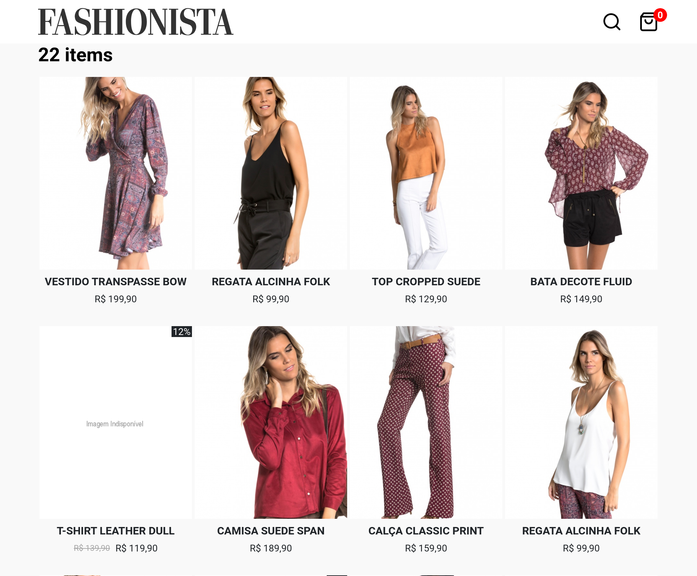

<h1 align="center">
    
</h1>




<h3 align="center">
    <a href="https://alancoosta-desafio-final.netlify.app/">Acessar a demonstração</a>
<h3 >

# Indice

- [Sobre](#-sobre)
- [Tecnologias Utilizadas](#-tecnologias-utilizadas)
- [Como baixar o projeto](#-como-baixar-o-projeto)

## 🔖 Sobre

O projeto **Fashionista** é o projeto prático proposto pelo curso de React online da [Codenation](https://github.com/codenation-dev)

---

## 🚀 Tecnologias utilizadas

O projeto foi desenvolvido utilizando as seguintes tecnologias

- [ReactJS](https://reactjs.org)
- [Redux](https://redux.js.org/)

---

## 🗂 Como baixar o projeto

```bash
    # Clonar o repositório
    $ git@github.com:AlanCoosta/codenation-desafio.git

    # Entrar no diretório
    $ cd codenation-desafio

    # Instalar as dependências
    $ yarn install

    # Iniciar o projeto
    $ yarn start
```

---

Desenvolvido 💜 por Alan Costa
